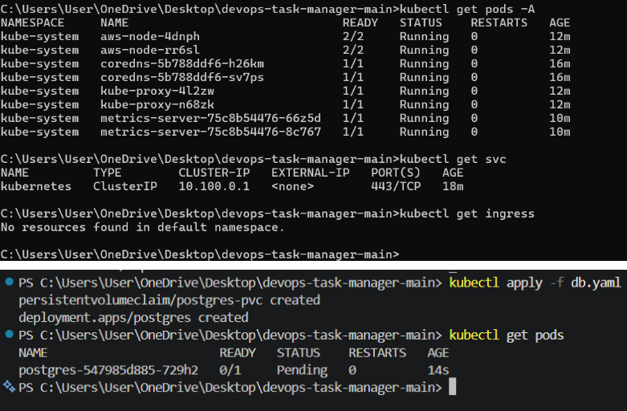
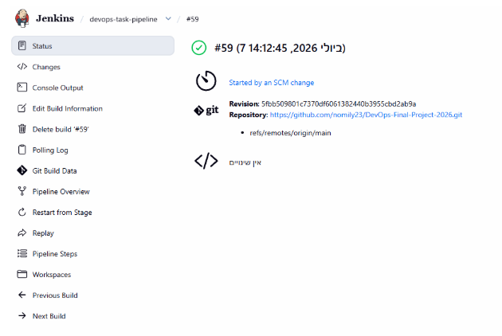
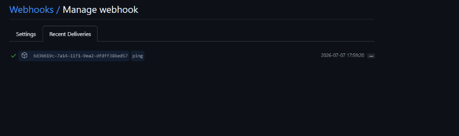

# DevOps Final Project - Task Manager

## Project Overview
פרויקט זה מציג מערכת ניהול משימות (Task Manager) מבוססת מיקרו-שירותים. המערכת כוללת ממשק משתמש, שרת API לניהול בקשות ומסד נתונים מסוג PostgreSQL, תוך שימוש בכלי DevOps מתקדמים לאוטומציה ופריסה.

## Architecture
המערכת בנויה משלוש שכבות:
1. **Frontend:** ממשק משתמש אינטראקטיבי.
2. **Backend:** שרת API המטפל בלוגיקה העסקית.
3. **Database:** מסד נתונים PostgreSQL לעמידות נתונים (Persistence).

## CI/CD Process
תהליך ה-CI/CD מבוצע באמצעות **Jenkins**. ברגע שמתבצע `git push` ל-Repository, מופעל Webhook המפעיל Pipeline אוטומטי הכולל:
- בניית Docker Images עבור השירותים.
- דחיפת ה-Images למאגר ה-AWS ECR.
- עדכון אוטומטי של ה-Deployment ב-Kubernetes.

*(אינטגרציה עם GitHub: אישור מסירה מוצלח של ה-Webhook)*

*(Pipeline ירוק ותקין)*

## Kubernetes Deployment
האפליקציה מנוהלת באמצעות קבצי YAML המגדירים את הפריסה ב-EKS:
- **db.yaml:** הגדרת ה-Postgres עם PersistentVolumeClaim (PVC).
- **backend.yaml:** פריסת ה-Backend עם 3 Replicas ו-Readiness Probe.
- **ingress.yaml:** חשיפת ה-Frontend החוצה.

*(סטטוס ה-Pods בקלאסטר)*

## Summary & Deployment Strategy
הפריסה לקלאסטר מוגדרת ב-Pipeline באמצעות פקודות `kubectl`. לצורך חיסכון בעלויות הענן, הקלאסטר הושבת לאחר תהליך הוולידציה, ולכן ה-Pipeline מוגדר להדגים את תהליך העדכון (Deployment logic demonstration).
